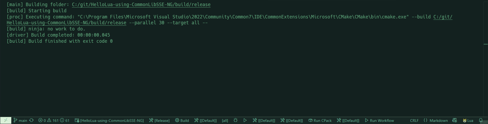
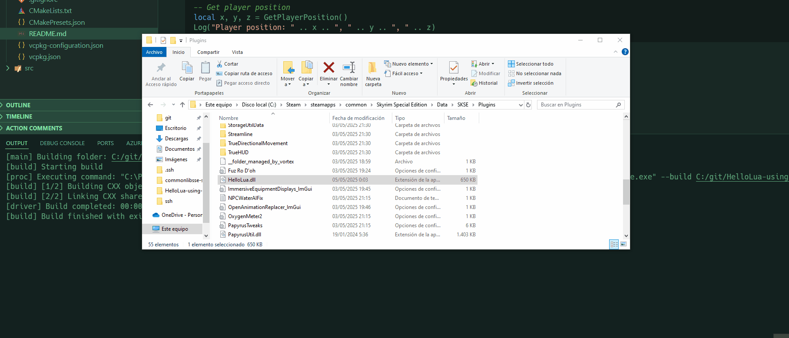

# HelloLua - Skyrim SKSE Plugin with Lua Integration

## Overview

HelloLua is a Skyrim Special Edition SKSE plugin that demonstrates how to integrate Lua scripting into an SKSE plugin using the CommonLibSSE-NG framework. This project showcases how to:

- Set up a basic SKSE plugin structure using CommonLibSSE-NG
- Integrate Lua 5.1 into your SKSE plugin
- Expose game functions to Lua scripts
- Track hit counts for NPCs in the game
- Create a simple Papyrus extension
- Use function hooking for game functionality

The project serves as a practical example for Skyrim modders who want to incorporate Lua scripting into their SKSE plugins.

## Features

- **Lua Scripting Interface**: Run Lua scripts from within your SKSE plugin
- **NPC Hit Counter**: Track and manipulate hit counts for NPCs
- **Papyrus Extensions**: Custom Papyrus functions available to game scripts
- **Function Hooks**: Example of hooking into game functions
- **Console Output**: Send messages to the Skyrim console from Lua
- **Game Data Access**: Get player position and other game data from Lua

## Requirements

- Skyrim Special Edition (supports both Anniversary Edition and pre-AE versions)
- [SKSE](https://skse.silverlock.org/)
- Visual Studio 2022 with C++20 support
- CMake 3.24 or higher
- vcpkg
- Git (for submodule management)

## Project Setup

This project uses Git submodules to include the Lua source code directly. After cloning the repository, you need to initialize and update the submodules:

```bash
git clone https://your-repository-url/HelloLua-CommonLibSSE-NG.git
cd HelloLua-CommonLibSSE-NG
git submodule init
git submodule update
```

If you've already cloned the repository without initializing submodules, you can do both steps at once with:

```bash
git submodule update --init
```

## Building

This project uses CMake and vcpkg for dependency management:

1.Make sure you've initialized the Git submodules as described above
2.Configure the project with CMake:

```bash
cmake -B build -S . --preset=release
```

3.Build the project:

```bash
cmake --build build --config Release
```

The built DLL will be placed in `build/release/HelloLua.dll`.



## Installation

1. Copy `HelloLua.dll` to your Skyrim SE installation: `<Skyrim SE>/Data/SKSE/Plugins/`
2. Create a folder `Scripts` in `<Skyrim SE>/Data/SKSE/Plugins/`
3. Copy the Lua scripts from the `Scripts` directory to `<Skyrim SE>/Data/SKSE/Plugins/Scripts/`



## Usage

### Lua API

The plugin exposes several functions to Lua scripts:

- `Log(message)`: Write a message to the SKSE log
- `PrintToConsole(message)`: Print a message to the Skyrim console
- `GetPlayerPosition()`: Returns player's x, y, z coordinates
- `TrackActor(formID)`: Start tracking hit counts for an actor
- `UntrackActor(formID)`: Stop tracking hit counts for an actor
- `GetHitCount(formID)`: Get the current hit count for an actor
- `IncrementHitCount(formID, [amount])`: Increase the hit count for an actor

### Example Script

```lua
-- Print a welcome message to the Skyrim console
PrintToConsole("HelloLua mod successfully loaded!")
```


### Papyrus Functions

This plugin also provides Papyrus functions under the `HitCounter` class:

- `TrackActor(Actor target)`: Start tracking hit counts
- `GetHitCount(Actor target)`: Get hit count for an actor
- `IncrementHitCount(Actor target, int amount)`: Add to hit count

## Project Structure

- `include/`: Header files
  - `Core/`: Core functionality headers
- `src/`: Source files
  - `Core/`: Implementation of core functionality
  - `Main.cpp`: Plugin entry point
- `Scripts/`: Lua scripts
  - `startup.lua`: Runs when the game loads
  - `utils.lua`: Utility functions for Lua scripts
- `ext/`: External dependencies
  - `lua/`: Lua 5.1 source code (Git submodule)

## License

This project is available as an open-source example for the Skyrim modding community.

## Credits

- Built with [CommonLibSSE-NG](https://github.com/CharmedBaryon/CommonLibSSE-NG)
- Uses [Lua 5.1](https://www.lua.org/)